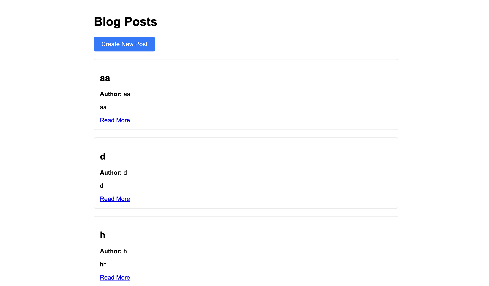
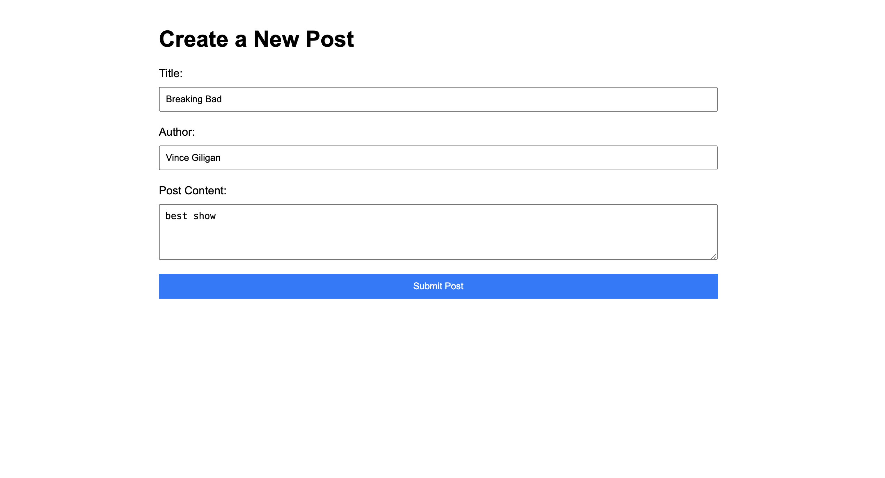
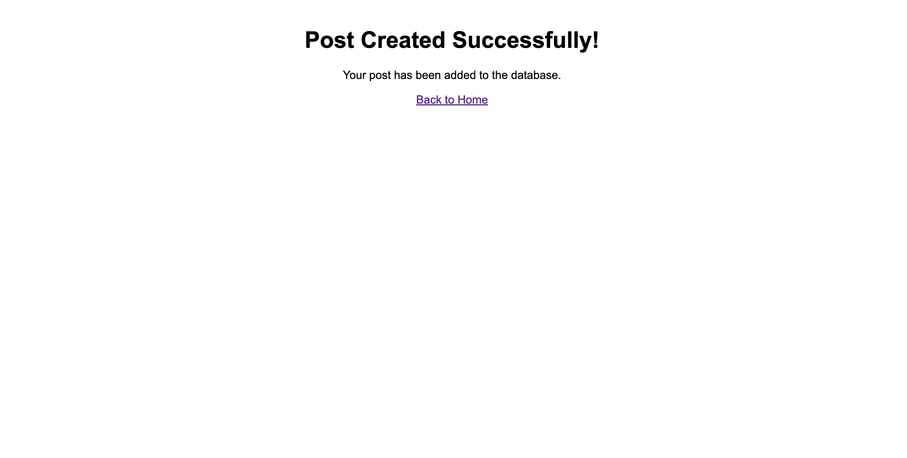
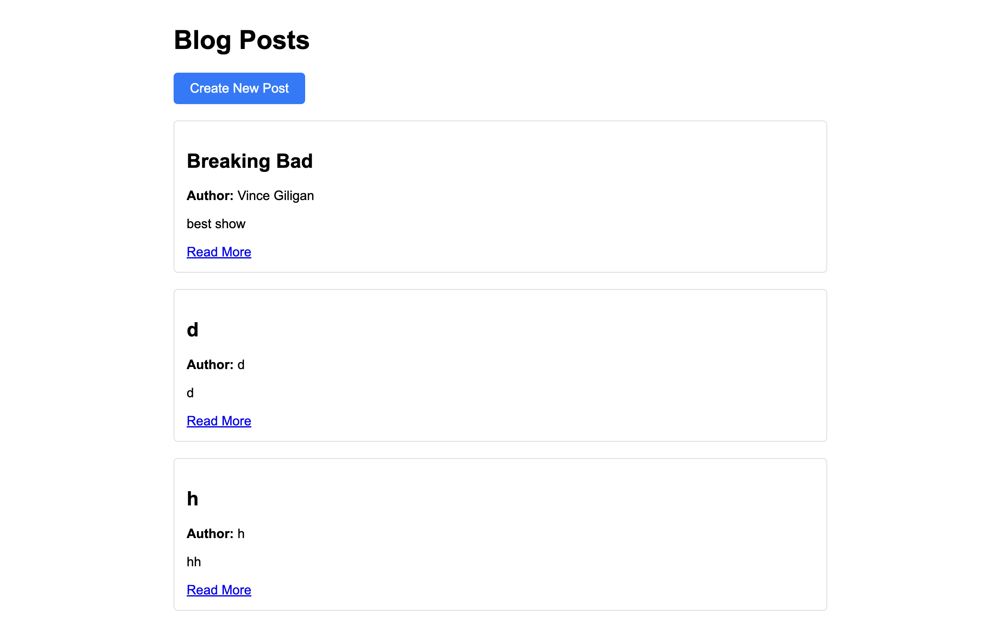

# Blog Post Application

Simple web application that allows users to create and view blog posts.

The application uses Express.js for the backend and Firebase for data storage.

Clone the repo + ADD YOUR OWN API!!!

## Screenshots

### Homepage (BEFORE posting)

### Create Post Form

### Success Page

### Homepage (AFTER posting)
